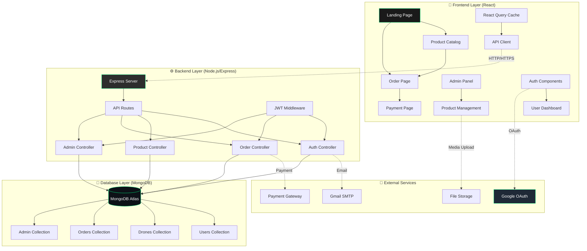
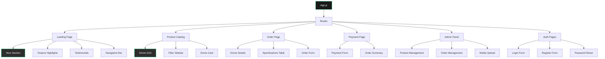

# Design Document

## Overview

The Arrow3 Aerospace Platform is a modern, dark-themed e-commerce application built using the MERN stack. The platform features a DJI-inspired design with neon accents, comprehensive drone catalog management, secure payment processing, and robust admin functionality. The architecture follows a three-tier pattern with React frontend, Express.js API backend, and MongoDB database, enhanced with external services for authentication, email, and payments.

## Architecture

### System Architecture Diagram



### Technology Stack

**Frontend:**
- React 18 with functional components and hooks
- Material-UI v5 for component library with dark theme customization
- React Router v6 for client-side routing
- React Query for server state management and caching
- Axios for HTTP client
- React Hook Form for form management
- Framer Motion for animations

**Backend:**
- Node.js with Express.js framework
- JWT for authentication tokens
- bcrypt for password hashing
- Multer for file upload handling
- Nodemailer with Gmail SMTP for email services
- Passport.js for Google OAuth integration
- Express-validator for input validation
- CORS for cross-origin resource sharing

**Database:**
- MongoDB Atlas for cloud database hosting
- Mongoose ODM for data modeling and validation
- GridFS for large file storage (images/videos)

**External Services:**
- Google OAuth 2.0 for social authentication
- Gmail SMTP for transactional emails
- Stripe/PayPal for payment processing
- Cloudinary for image/video optimization and CDN

## Components and Interfaces

### Frontend Components Architecture



### API Endpoints Design

**Authentication Routes:**
```
POST /api/auth/register - User registration
POST /api/auth/login - User login
POST /api/auth/google - Google OAuth callback
POST /api/auth/forgot-password - Password reset request
POST /api/auth/reset-password - Password reset confirmation
GET /api/auth/verify-token - Token validation
```

**Product Routes:**
```
GET /api/drones - Get all drones (public)
GET /api/drones/:id - Get specific drone details
POST /api/drones - Create new drone (admin only)
PUT /api/drones/:id - Update drone (admin only)
DELETE /api/drones/:id - Delete drone (admin only)
POST /api/drones/:id/media - Upload drone media (admin only)
```

**Order Routes:**
```
POST /api/orders - Create new order (authenticated)
GET /api/orders/user/:userId - Get user orders (authenticated)
GET /api/orders/:id - Get specific order (authenticated)
PUT /api/orders/:id/status - Update order status (admin only)
```

**Payment Routes:**
```
POST /api/payments/create-intent - Create payment intent
POST /api/payments/confirm - Confirm payment
GET /api/payments/:orderId/status - Get payment status
```

### Component Props and State Management

**Key React Components:**

```typescript
// DroneCard Component
interface DroneCardProps {
  drone: {
    id: string;
    name: string;
    image: string;
    price: number;
    specifications: DroneSpecs;
  };
  onOrderClick: (droneId: string) => void;
}

// OrderForm Component
interface OrderFormProps {
  drone: Drone;
  onSubmit: (orderData: OrderData) => void;
  loading: boolean;
}

// AdminProductForm Component
interface AdminProductFormProps {
  drone?: Drone;
  onSubmit: (droneData: DroneFormData) => void;
  onCancel: () => void;
}
```

## Data Models

### MongoDB Collections Schema

**Users Collection:**
```javascript
{
  _id: ObjectId,
  email: String (unique, required),
  password: String (hashed with bcrypt),
  firstName: String (required),
  lastName: String (required),
  googleId: String (optional),
  role: String (enum: ['customer', 'admin'], default: 'customer'),
  isEmailVerified: Boolean (default: false),
  resetPasswordToken: String (optional),
  resetPasswordExpires: Date (optional),
  createdAt: Date (default: Date.now),
  updatedAt: Date (default: Date.now)
}
```

**Drones Collection:**
```javascript
{
  _id: ObjectId,
  name: String (required),
  model: String (required),
  price: Number (required),
  description: String,
  images: [String], // URLs to images
  videos: [String], // URLs to videos
  specifications: {
    weight: Number, // in grams
    dimensions: {
      length: Number, // in cm
      width: Number,
      height: Number
    },
    batteryCapacity: Number, // in mAh
    flightTime: Number, // in minutes
    maxSpeed: Number, // in km/h
    cameraResolution: String,
    stabilization: String,
    controlRange: Number, // in meters
    gpsSupport: Boolean,
    obstacleAvoidance: Boolean,
    returnToHome: Boolean,
    windResistanceLevel: Number,
    appCompatibility: [String],
    aiModes: [String]
  },
  category: String (enum: ['camera', 'handheld', 'power', 'specialized']),
  inStock: Boolean (default: true),
  stockQuantity: Number (default: 0),
  featured: Boolean (default: false),
  createdAt: Date (default: Date.now),
  updatedAt: Date (default: Date.now)
}
```

**Orders Collection:**
```javascript
{
  _id: ObjectId,
  userId: ObjectId (ref: 'User'),
  droneId: ObjectId (ref: 'Drone'),
  quantity: Number (default: 1),
  totalAmount: Number (required),
  status: String (enum: ['pending', 'confirmed', 'processing', 'shipped', 'delivered', 'cancelled']),
  paymentStatus: String (enum: ['pending', 'completed', 'failed', 'refunded']),
  paymentIntentId: String, // Stripe payment intent ID
  shippingAddress: {
    street: String (required),
    city: String (required),
    state: String (required),
    zipCode: String (required),
    country: String (required)
  },
  customerInfo: {
    firstName: String (required),
    lastName: String (required),
    email: String (required),
    phone: String (required)
  },
  orderDate: Date (default: Date.now),
  estimatedDelivery: Date,
  trackingNumber: String (optional),
  notes: String (optional)
}
```

## Error Handling

### Frontend Error Handling Strategy

**React Error Boundaries:**
```javascript
// Global error boundary for unhandled React errors
class ErrorBoundary extends React.Component {
  constructor(props) {
    super(props);
    this.state = { hasError: false, error: null };
  }
  
  static getDerivedStateFromError(error) {
    return { hasError: true, error };
  }
  
  componentDidCatch(error, errorInfo) {
    console.error('Error caught by boundary:', error, errorInfo);
    // Log to error reporting service
  }
}
```

**API Error Handling:**
```javascript
// Axios interceptor for global error handling
axios.interceptors.response.use(
  (response) => response,
  (error) => {
    if (error.response?.status === 401) {
      // Redirect to login
      window.location.href = '/login';
    } else if (error.response?.status >= 500) {
      // Show generic server error message
      toast.error('Server error. Please try again later.');
    }
    return Promise.reject(error);
  }
);
```

### Backend Error Handling

**Global Error Middleware:**
```javascript
const errorHandler = (err, req, res, next) => {
  let error = { ...err };
  error.message = err.message;

  // Log error
  console.error(err);

  // Mongoose bad ObjectId
  if (err.name === 'CastError') {
    const message = 'Resource not found';
    error = new ErrorResponse(message, 404);
  }

  // Mongoose duplicate key
  if (err.code === 11000) {
    const message = 'Duplicate field value entered';
    error = new ErrorResponse(message, 400);
  }

  // Mongoose validation error
  if (err.name === 'ValidationError') {
    const message = Object.values(err.errors).map(val => val.message);
    error = new ErrorResponse(message, 400);
  }

  res.status(error.statusCode || 500).json({
    success: false,
    error: error.message || 'Server Error'
  });
};
```

**Input Validation:**
```javascript
// Express-validator middleware for input validation
const validateDroneInput = [
  body('name').notEmpty().withMessage('Drone name is required'),
  body('price').isNumeric().withMessage('Price must be a number'),
  body('specifications.weight').isNumeric().withMessage('Weight must be a number'),
  // Additional validations...
];
```

## Testing Strategy

### Frontend Testing

**Unit Testing with Jest and React Testing Library:**
```javascript
// Component testing example
describe('DroneCard Component', () => {
  test('renders drone information correctly', () => {
    const mockDrone = {
      id: '1',
      name: 'Arrow3 Pro',
      price: 1299,
      image: 'drone.jpg'
    };
    
    render(<DroneCard drone={mockDrone} onOrderClick={jest.fn()} />);
    
    expect(screen.getByText('Arrow3 Pro')).toBeInTheDocument();
    expect(screen.getByText('$1,299')).toBeInTheDocument();
  });
});
```

**Integration Testing:**
```javascript
// API integration testing
describe('Drone API Integration', () => {
  test('fetches drones successfully', async () => {
    const { result } = renderHook(() => useQuery('drones', fetchDrones));
    
    await waitFor(() => {
      expect(result.current.isSuccess).toBe(true);
      expect(result.current.data).toHaveLength(5);
    });
  });
});
```

### Backend Testing

**API Endpoint Testing with Jest and Supertest:**
```javascript
describe('Drone Routes', () => {
  test('GET /api/drones returns all drones', async () => {
    const response = await request(app)
      .get('/api/drones')
      .expect(200);
    
    expect(response.body.success).toBe(true);
    expect(Array.isArray(response.body.data)).toBe(true);
  });
  
  test('POST /api/drones creates new drone (admin only)', async () => {
    const droneData = {
      name: 'Test Drone',
      price: 999,
      specifications: { weight: 400 }
    };
    
    const response = await request(app)
      .post('/api/drones')
      .set('Authorization', `Bearer ${adminToken}`)
      .send(droneData)
      .expect(201);
    
    expect(response.body.data.name).toBe('Test Drone');
  });
});
```

**Database Testing:**
```javascript
// MongoDB testing with in-memory database
describe('Drone Model', () => {
  beforeAll(async () => {
    await mongoose.connect(process.env.MONGODB_TEST_URI);
  });
  
  afterAll(async () => {
    await mongoose.connection.close();
  });
  
  test('creates drone with valid data', async () => {
    const droneData = {
      name: 'Test Drone',
      price: 999,
      specifications: { weight: 400 }
    };
    
    const drone = new Drone(droneData);
    const savedDrone = await drone.save();
    
    expect(savedDrone.name).toBe('Test Drone');
    expect(savedDrone._id).toBeDefined();
  });
});
```

### End-to-End Testing

**Cypress E2E Testing:**
```javascript
describe('Drone Purchase Flow', () => {
  it('allows user to browse and purchase a drone', () => {
    cy.visit('/');
    cy.contains('Take Flight Now').click();
    cy.url().should('include', '/order');
    
    cy.get('[data-testid="order-button"]').click();
    cy.url().should('include', '/payment');
    
    cy.get('[data-testid="payment-form"]').within(() => {
      cy.get('input[name="cardNumber"]').type('4242424242424242');
      cy.get('input[name="expiry"]').type('12/25');
      cy.get('input[name="cvc"]').type('123');
    });
    
    cy.get('[data-testid="submit-payment"]').click();
    cy.contains('Order Confirmed').should('be.visible');
  });
});
```

This comprehensive design document provides the foundation for building the Arrow3 Aerospace platform with all the specified features, security measures, and performance optimizations.